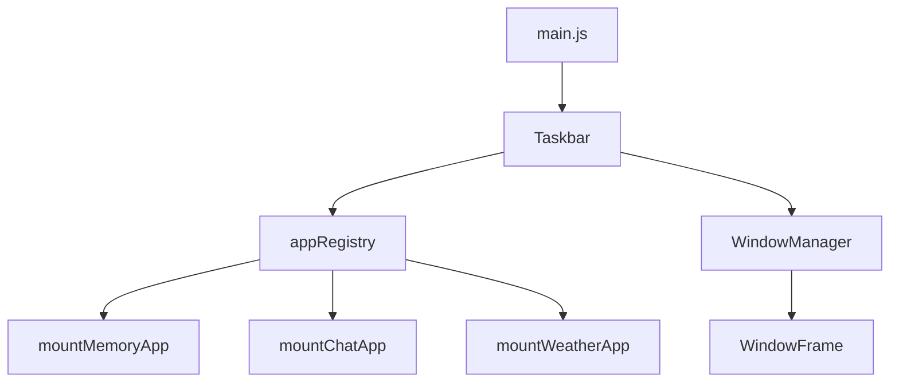
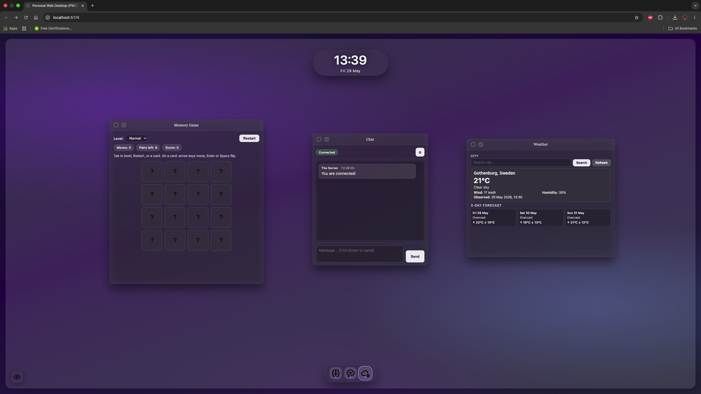
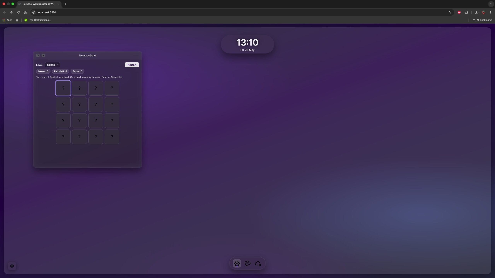
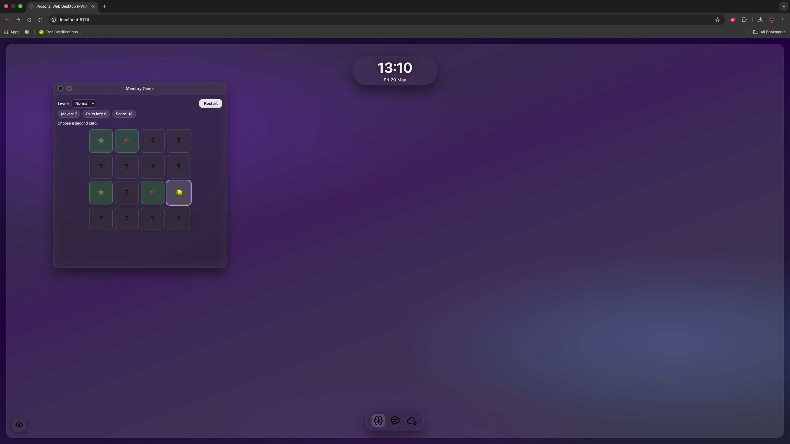
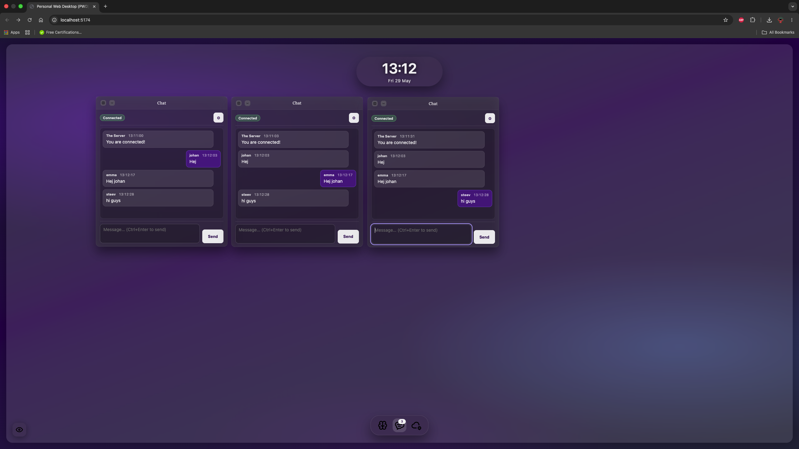
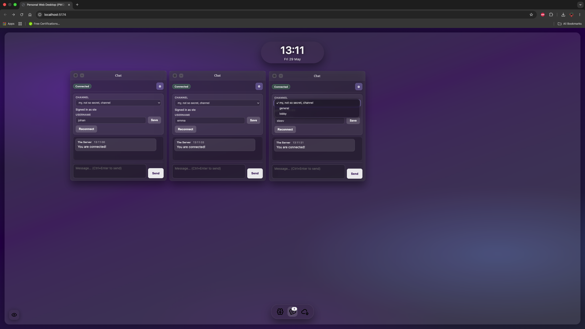
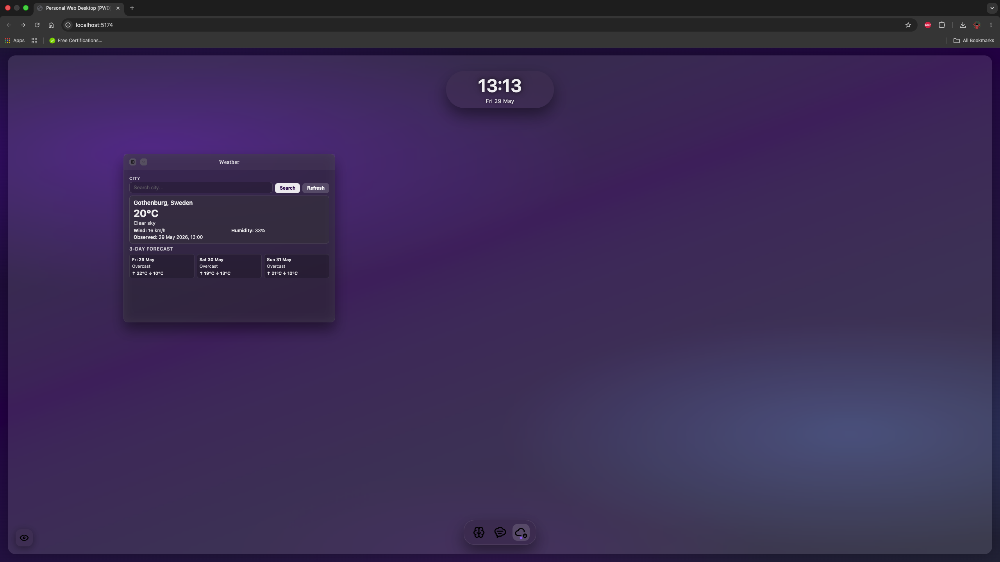
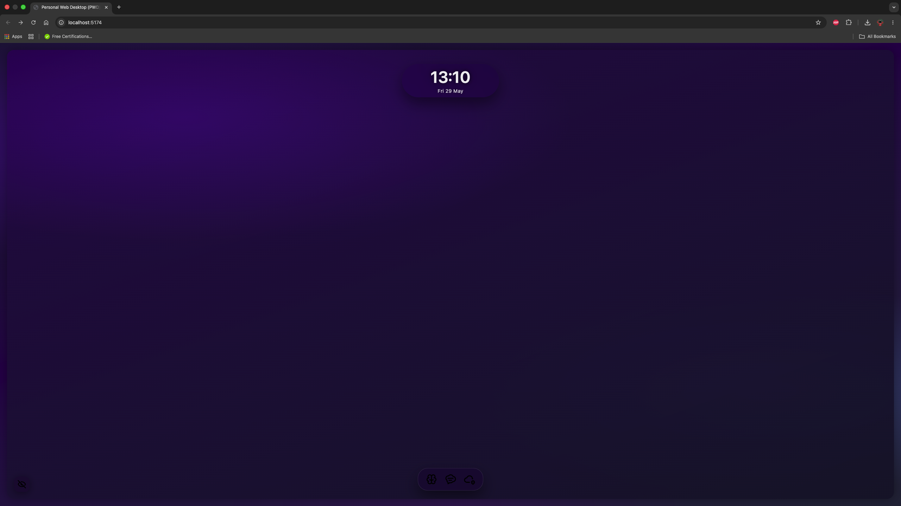
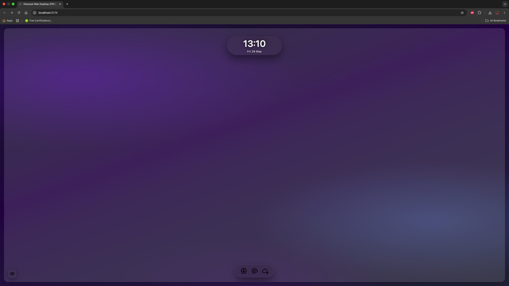

# Personal Web Desktop

A browser-based **Personal Web Desktop (PWD)** built as a single-page application (SPA). The project simulates a small desktop environment inside the browser: a glass-style desktop, a bottom dock, draggable windows with automatic **wrapping cascade** placement, and three applications (Memory, Chat, and Weather) that run independently inside those windows.

The stack is **vanilla JavaScript (ES modules)**, **Vite** for development and production builds, and **ESLint** for code quality. No frontend framework is used; the window system and apps are implemented with classes and clear module boundaries.

## Screenshot


## Installation

From the project root:

```bash
npm install
```

---

## Development

Start the Vite dev server:

```bash
npm run dev
```

Open the URL shown in the terminal (usually `http://localhost:5173/`).

---

## Production build

Build optimized static files into `dist/`:

```bash
npm run build
```

Preview the production build locally:

```bash
npm run preview
```

The `dist/` folder is generated by Vite and can be included in submission if your course requires a built artifact. Do not edit files inside `dist/` by hand.

---

## Lint

Run ESLint on the project source:

```bash
npm run lint
```

Lint errors are not suppressed; the command must exit with code 0 for a clean check.

---

## Usage guide

1. **Open apps** — Click **Memory**, **Chat**, or **Weather** on the bottom taskbar (dock). Each **click** opens a **new window** for that app.
2. **Taskbar status** — Each app has one dock icon that is both launcher and status indicator:
   - **0 or 1** open window: no numeric badge (one open window shows a subtle active dot).
   - **2 or more** open windows: a small badge shows the count (e.g. `2`, `3`).
   - **Active** — at least one non-minimized window for that app.
   - **Minimized** — all open windows for that app are minimized (icon appears dimmed).
   - **Shift+click** (or **Shift+Enter** / **Shift+Space** when the icon is focused) restores the most recent minimized window for that app (if any). A normal click or **Enter** / **Space** always opens a new window.
3. **Focus / z-order** — Click anywhere inside a window to bring it to the front. The focused window stays on top.
4. **Drag windows** — Drag by the **title bar** only (not the content area).
5. **Minimize** — Use the minimize button on the title bar. The window hides; use **Shift+click** on that app’s dock icon to restore the latest minimized window, or open another window with a normal click.
6. **Close** — Use the close button. Closing one window does not affect others; the dock badge updates from the real open-window count.
7. **Window placement** — Each new window is placed in a **cascade** from the top-left: offset down and to the right. When the next window would reach the bottom of the desktop (above the dock), the next one starts a **new column** near the top and cascades again. Placement respects window size and leaves space for the taskbar. **Dragging** a window does not change where future windows open.
8. **Desktop extras** — The clock updates live. The eye button toggles the desktop glass blur effect.

---

## Keyboard accessibility

The desktop shell and all three apps support keyboard use. Visible `:focus-visible` outlines mark the focused control.

### Dock (taskbar)

- **Tab** reaches each app icon (Memory, Chat, Weather).
- **Enter** or **Space** on an icon opens a **new window** for that app (same as a normal click).
- **Shift+Enter** or **Shift+Space** restores the **most recent minimized** window for that app, if any (same as Shift+click). If nothing is minimized, a new window opens as usual.
- **Context Menu** key or **Shift+F10** on an icon with open windows opens a **Close all … windows** menu (same as right-click). The menu item is focusable; **Enter** or **Space** activates it; **Escape** closes the menu and returns focus to the dock icon.

### Windows

- **Tab** reaches the **close** and **minimize** buttons on the title bar.
- **Enter** or **Space** activates them. Click anywhere in the window body to focus it; drag only from the title bar.

### Memory

The Memory game can be **completed using only the keyboard** (assignment requirement).

- **Tab** reaches the **level** selector, **Restart** button, and the card grid (one card at a time in the tab order).
- **Level selector** — change difficulty with the keyboard (native `<select>`).
- **Restart** — **Enter** or **Space** starts a new game; after win, focus moves to Restart.
- **Card grid** (once focused):
  - **ArrowLeft** / **ArrowRight** — previous / next playable card
  - **ArrowUp** / **ArrowDown** — move by one row (uses the current level’s column count)
  - **Enter** or **Space** — flip the focused card (`preventDefault` on Space so the page does not scroll)
  - Matched cards are skipped when possible; keyboard input is scoped to each Memory window instance.

### Chat

- **Username gate** (first launch) — Tab to the username field and **Join chat**; **Enter** in the field or on the button submits.
- **Composer** — Tab to the `<textarea>` and **Send**; **Ctrl+Enter** sends a non-empty message.
- **Settings (⚙)** — **Enter** or **Space** toggles the panel; inside: change username, **channel** selector, and **Reconnect** are keyboard reachable (native controls).

### Weather

- **Tab** to the city **input**; **Enter** runs search.
- **Search** and **Refresh** buttons work with **Enter** or **Space**. Controls disable during loading without trapping focus.

---

## Implemented assignment features

| Requirement | Implementation |
|-------------|----------------|
| **F1 — PWD functionality** | Custom windows (create, drag, focus, z-index, minimize, restore, close), wrapping cascade placement, dock with one icon per app (launcher + window count/status), multiple instances per app |
| **F2 — Setup & quality** | Vite (`dev` / `build` / `preview`), ESLint (`lint`), ES modules, JSDoc on exported APIs, `npm run build` produces `dist/` |
| **F3 — Memory** | Pairs matching with **Easy / Normal / Hard** levels, score (+10 match, −2 mismatch), mouse + keyboard, moves counter, restart, win message |
| **F4 — Chat** | WebSocket to course server; first-time username prompt; `localStorage` username; textarea send; latest 20 messages per window; compact settings panel (extended feature) |
| **F5 — Additional app (Weather)** | Self-made weather app using **Open-Meteo** (no API key) |

### Optional-style enhancements (actually implemented)

- **Memory:** Easy (4 pairs, 4×2), Normal (8 pairs, 4×4), Hard (12 pairs, 4×6); score system; full keyboard play (level, restart, arrow navigation, Enter/Space); per-window game state and level
- **Windows:** Wrapping cascade layout in `WindowManager` (column wrap before dock)
- **Chat:** Compact settings panel (username, channel, reconnect); connection status in toolbar; message timestamps; Ctrl+Enter to send; own-message styling; multiple independent windows
- **Weather:** 3-day forecast; refresh button; last city in `localStorage`; default city Växjö; loading and error states
- **Desktop:** Live clock; blur toggle on desktop background; grouped dock icons with count badges; Shift+click / Shift+Enter restore for minimized windows; **dock context menu** (right-click, Context Menu, or Shift+F10) to close all windows for one app (enhancement)

---

## Applications

### Memory

Classic pairs matching game with a **level** selector (default **Normal**):

| Level | Pairs | Grid |
|-------|-------|------|
| **Easy** | 4 | 4×2 |
| **Normal** | 8 | 4×4 |
| **Hard** | 12 | 4×6 |

Each window has its own independent game (level, board, score, and moves). **Score:** +10 per matched pair, −2 per mismatch (never below 0). Play with the mouse or **keyboard only** — Tab to level and Restart, then use arrow keys to move between cards and **Enter** or **Space** to flip (see [Keyboard accessibility](#keyboard-accessibility)). Shows moves, pairs left, score, restart, and a win message with final score and moves. Changing level or restart resets only that window.

### Chat

Real-time chat via WebSocket (`wss://courselab.lnu.se/message-app/socket`) using the course message format. **Assignment behaviour:** Chat runs in a desktop window; you can open several Chat windows at once (each has its own message list and WebSocket). On first use (no `pwd-chat-username` in `localStorage`), an in-window username form appears before sending; the username is saved and reused on reload and in new Chat windows. Messages are sent with a `<textarea>` (Send button or **Ctrl+Enter**); empty/whitespace messages are ignored. Each Chat instance keeps the **latest 20 messages** received since that window was opened (older messages drop off). **Extended feature — compact settings panel (⚙):** change username, pick channel (presets), and reconnect; connection status is shown in the toolbar; every message shows a timestamp. Username gate, composer, Send, settings, channel selector, reconnect, and change username are keyboard usable (see [Keyboard accessibility](#keyboard-accessibility)).

### Weather

City search using **Open-Meteo** geocoding and forecast APIs (no API key). Shows current conditions (temperature, condition text, wind, humidity, observation time) and a 3-day forecast. Last searched city is saved in `localStorage` (`pwd-weather-city`). Default city **Växjö** when nothing is saved. Refresh reloads the current city. Friendly errors if the city is not found or the network fails. City input (**Enter** to search), Search, and Refresh are keyboard usable (see [Keyboard accessibility](#keyboard-accessibility)).

---

## Code structure

The project is organized so the **desktop shell** stays separate from **applications**.

| Path | Role |
|------|------|
| `index.html` | Page shell: desktop, clock, taskbar placeholders, script entry |
| `src/main.js` | Boots `WindowManager`, `Taskbar`, clock, and blur toggle |
| `src/apps/appRegistry.js` | App metadata (icons, titles) and `createAppContent()` factory |
| `src/ui/window/windowManager.js` | Creates and tracks windows; wrapping cascade placement; focus, z-index, minimize, close; events |
| `src/ui/window/windowFrame.js` | One window’s DOM: title bar, buttons, content area, pointer drag |
| `src/ui/compenents/Taskbar.js` | Dock: one icon per app (launcher + sync badges/state from `WindowManager`) |
| `src/ui/compenents/AppButton.js` | Dock app icon (badge, active dot, minimized/active classes) |
| `src/apps/memory/` | Memory MVC + `mountMemoryApp()` |
| `src/apps/chat/` | Chat MVC + config + `mountChatApp()` |
| `src/apps/weather/` | Weather MVC + config + `mountWeatherApp()` |
| `style/` | Global desktop, taskbar, window, and per-app CSS |
| `assets/icons/` | Taskbar and window control icons |

**How the pieces connect:** When the page loads, `main.js` creates a `WindowManager` bound to the `#desktop` element and a `Taskbar` that receives the manager and the `desktopApps` list from `appRegistry.js`. The taskbar renders **three dock icons** (Memory, Chat, Weather). A normal click calls `createAppContent(app)` and `WindowManager.createWindow()` to open a new window. After mount, the manager measures the window and assigns a **cascade position** (`#getNextWindowPosition`): each new window steps down and right; when the stack would go under the dock, placement continues in a new column from the top. Existing windows are not moved when you open or close others; user-dragged positions are kept. The taskbar listens for manager events and **recomputes** each app’s open-window count from `getWindowsByApp()`—badges show `2+`, a dot shows one visible window, and minimized/active styles reflect current state. **Shift+click** on an icon restores the most recent minimized window for that app via `getMostRecentMinimizedWindowByApp()`. Each app is responsible for its own UI and logic inside its window root; the window system does not know game or chat rules. Apps use small MVC-style splits (model / view / controller) where it helps readability. State that must survive reloads (chat username, weather city) uses `localStorage`; per-window state (game board, message list in that window) stays inside each instance. DOM is built with `createElement` and `textContent` rather than `innerHTML` for user-facing strings. CSS is split between shared window chrome and per-app styles imported from each app’s `index.js`.

### Module diagram



---

## Testing checklist

Use this list before submission:

### Desktop / windows

- [ ] `npm run dev` starts without errors
- [ ] Desktop, clock, dock (three app icons), and blur toggle visible
- [ ] Clicking an app icon opens a new window
- [ ] Dock shows no badge for 0–1 windows; badge `2`, `3`, … for multiple windows of the same app
- [ ] Closing windows updates the badge correctly (never stuck)
- [ ] All minimized for an app → dimmed dock icon; **Shift+click** or **Shift+Enter** restores latest minimized window
- [ ] Dock icons: Tab, Enter/Space open app; Context Menu or Shift+F10 opens Close all (when windows open); Escape closes menu
- [ ] Window close/minimize: Tab and Enter/Space work
- [ ] No separate per-window icons on the dock (only Memory, Chat, Weather)
- [ ] Windows drag by title bar
- [ ] Click content or title bar brings window to front; title bar drag still works
- [ ] Minimize hides window; close removes only that window
- [ ] Multiple windows of the same app work independently
- [ ] Opening many windows cascades down/right; new column starts before the dock (no windows under dock)
- [ ] Dragging a window does not reset placement of later new windows

### Memory

- [ ] Game playable with mouse
- [ ] Keyboard only: Tab to level, Restart, grid; arrows move; Enter/Space flip; complete Easy game without mouse
- [ ] Level selector and Restart usable with keyboard
- [ ] Easy / Normal / Hard levels work; default Normal; two windows can use different levels
- [ ] Score: +10 match, −2 mismatch (not below 0); moves and pairs left update
- [ ] Restart keeps level; win message shows score and moves
- [ ] Two Memory windows do not share game state

### Chat

- [ ] First use asks for username (if not in `localStorage`)
- [ ] Username persists after reload and in new Chat windows
- [ ] Textarea + Send and Ctrl+Enter send non-empty messages
- [ ] Keyboard: username gate, settings (⚙), channel, reconnect, change username
- [ ] Up to 20 messages shown with timestamps
- [ ] Change username and channel selector work
- [ ] Connection status visible; Reconnect usable; app does not crash if server unavailable

### Weather

- [ ] Search by city (button, Enter in input, keyboard Search/Refresh)
- [ ] Empty search shows validation message
- [ ] Current weather + 3-day forecast display
- [ ] Refresh works; last city saved; default Växjö when empty storage
- [ ] Invalid city / network error shows friendly message without crashing SPA
- [ ] Two Weather windows can show different searches

### Build / lint

- [ ] `npm run lint` passes
- [ ] `npm run build` completes and `dist/` is created

---

## Known limitations

- **Chat:** Each Chat window opens its own WebSocket connection. There is no automatic reconnect on disconnect; use the **Reconnect** button.
- **Weather:** Last city is stored globally in `localStorage`, but each window keeps its own on-screen data until you search or refresh in that window.
- **Desktop:** Background uses CSS gradients only (`style/main.css`). Files in `assets/images/` are legacy and not loaded.
- **Folder name:** UI components live under `src/ui/compenents/` (typo for “components”).
- **Tests:** No automated unit or E2E test suite; verification is manual.
- **Routing:** No URL router; apps are opened only from the taskbar.
- **Window placement:** Cascade index does not shrink when windows close; columns may wrap horizontally on very busy desktops.

---

## Additional screenshots

These screenshots show the main implemented parts of the Personal Web Desktop.

### Desktop overview



### Memory game





### Chat app





### Weather app



### Desktop layout variants





## Submission notes

Before handing in the assignment, complete these steps **manually**:

1. **Presentation video (5–7 minutes)**  
   Record yourself with **face cam** visible. Demonstrate:
   - Personal Web Desktop (cascade windows, dock with app counts, drag, focus, minimize, close)
   - Memory (levels, score, keyboard if shown)
   - Chat (username, send message, show timestamps / channel if relevant)
   - Weather (search city, forecast, refresh)

2. **Screenshot**  
   Add `docs/screenshot.png` and verify it displays in this README.

3. **Git tag**  
   Tag the submission commit, for example: `v1.0.0`

4. **Push**  
   Push commits and tags to your GitLab remote.

5. **GitLab issue**  
   Create the course issue and describe **F1–F5** and which optional features you implemented (channel selector, username change, reconnect, timestamps, weather persistence, etc.).

6. **Built files (if required)**  
   Run `npm run build` and include or deploy `dist/` per course instructions.

---

## License

University assignment project — follow your course guidelines for reuse and attribution.
